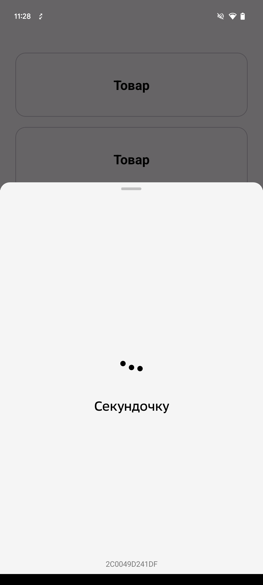
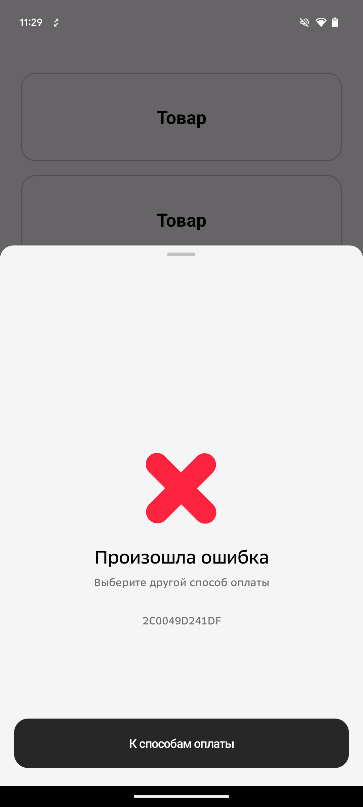

# [EcomSdkIOSDoc](https://sdkpay.github.io/EcomSdkIOSDoc)

#### [Регистрация заказов в платежном шлюзе Сбера](https://sdkpay.github.io/EcomSdkIOSDoc/order_registration) | [Начало работы](https://sdkpay.github.io/EcomSdkIOSDoc/start) | [Сценарий оплаты](https://sdkpay.github.io/EcomSdkIOSDoc/payment_script) | [Работа в режиме песочницы](https://sdkpay.github.io/EcomSdkIOSDoc/sandbox_mode) | [Вспомогательные структуры данных](https://sdkpay.github.io/EcomSdkIOSDoc/data_structures) | [Актуальная версия SDK](https://sdkpay.github.io/EcomSdkIOSDoc/version) | [Поддержка](https://sdkpay.github.io/EcomSdkIOSDoc/support)

 

# Поддержка

## Обращение в поддержку

> В случае возникновения проблем при интеграции, просьба направлять запрос на: **support@ecom.sberbank.ru**

Для конструктивного разбора проблемы, просьба направлять следующие данные:
1. Видео/ скриншоты процесса оплаты
2. Номер заказа Ecom: `bankinvoiceid`
3. Модель устройства, где происходит оплата
4. Текст/ скрин ошибки
5. Время старта сценария оплаты
6. *Stacktrace* при краше приложения
7. `[LocalSessionID]()` с экрана ошибки/успеха оплаты, из колбэка или с экрана загрузки sdk

 

<!-- ## LocalSessionId

### Идентификатор сессии в Ecom inApp

Идентификатор сессии (`localSessionId`) создается при каждой попытке оплаты через Ecom SDK. Идентификатор используется для разбора инцидентов и отладки работы SDK. `LocalSessionId` можно найти в следующих компонентах:
- На экране загрузки SDK после старта оплаты:

- На результирующем экране ошибки:

  -->
